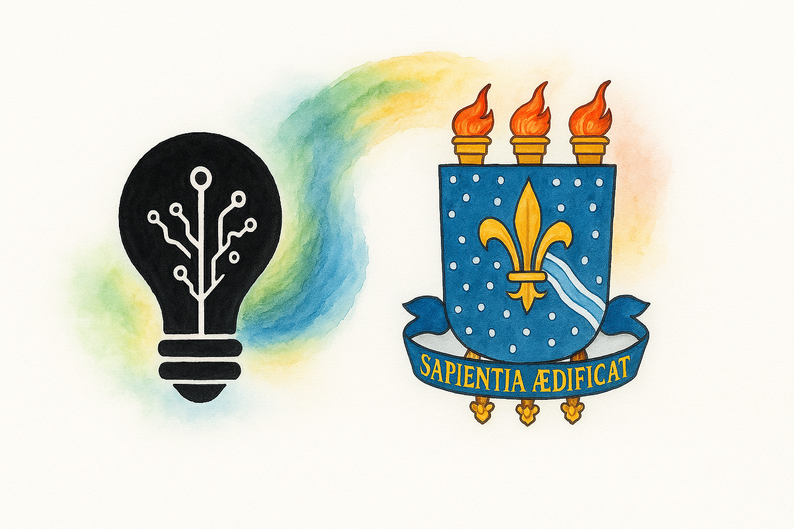
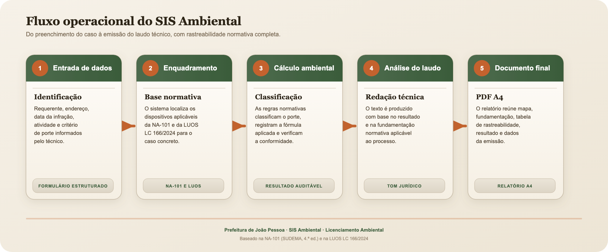
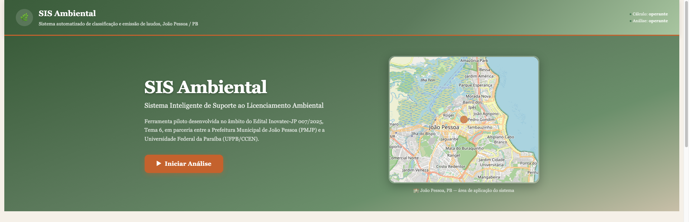
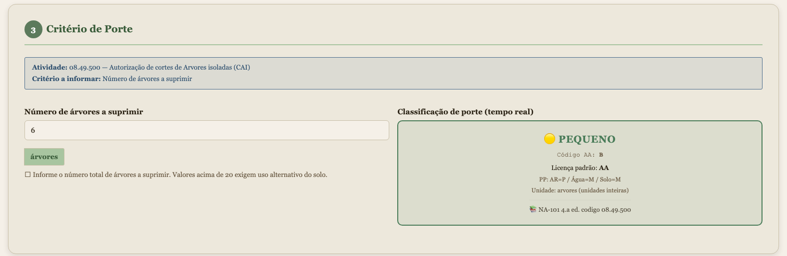
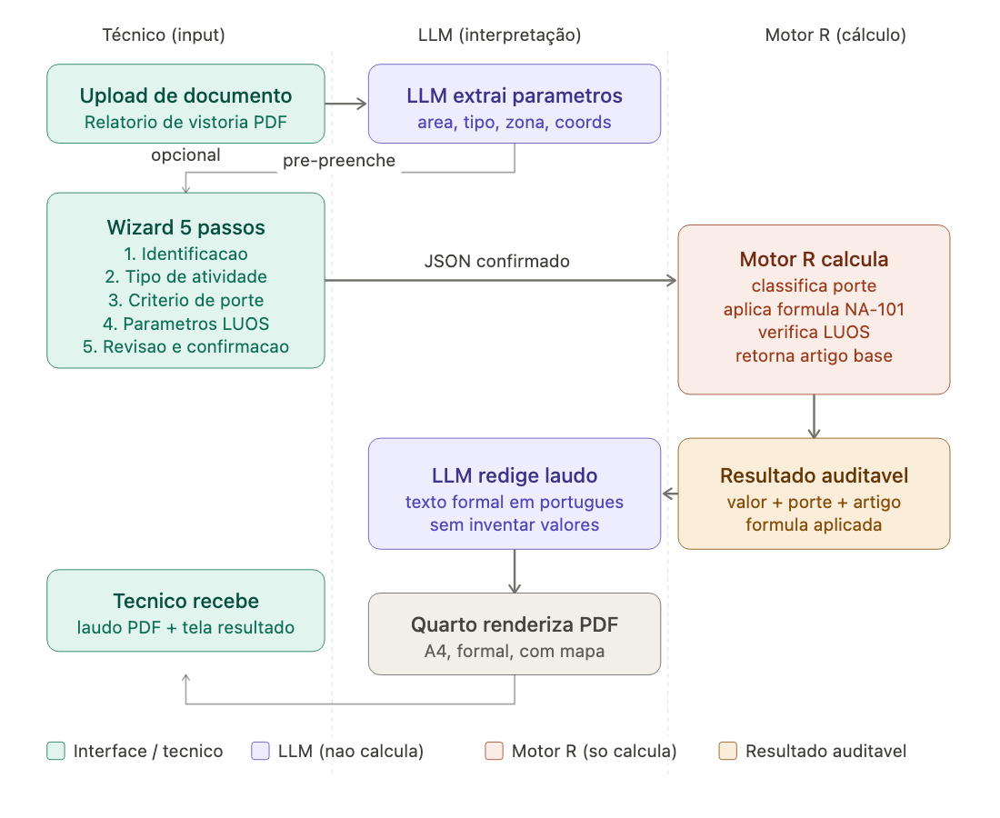

<!-- ```{r} -->

<!-- #| echo: false -->

<!-- #| warning: false -->

<!-- #| eval: true -->

<!-- if(fs::dir_exists("index_files/")) -->

<!--   fs::dir_delete("index_files/") -->

<!-- ``` -->

:::: {.columns}
::: {.column width="55%"}
::: r-fit-text
Parceria

<br>
<br>

Inovatec + UFPB

<br>

[Licenciamento Ambiental + Inteligência Artificial]{.flow}


<br>

🌍🌊💧🌲🪵🌱
:::
:::
::: {.column width="45%"}
<br>
<br>
{width=90% fig-align="center"}
:::
::::

<!-- #  {.title background-image="imgs/inovatec_ufpb.png" background-size="100% 100%"} -->

<!-- #  {.title}

::: r-fit-text
[Edital N.º 007/2025, INOVATEC - JP]{.flow}
::: -->

<!-- # Conhecendo o Departamento de Estatística da UFPB {.title} -->

<!-- ## Nosso segundo lar {.r-fit-text background-color="black" background-image="https://raw.githubusercontent.com/prdm0/imagens/main/foto_aerea_ufpb.jpeg" background-size="1600px" background-repeat="repeat" background-opacity="0.35"}

```{r width = 100, height = 100, echo = FALSE, fig.cap="Departamento de Estatística da UFPB."}
library(leaflet)
leaflet() |>
  addMarkers(-34.846199, -7.140400) |>
  leaflet::addTiles() |>
  setView(
    -34.846199,
    -7.140400,
    zoom = 37,
    options = popupOptions(
      minWidth = 1600,
      maxWidth = 1500
    )
  )
``` -->


## Equipe
Equipe multidisciplinar com experiência em estatística, computação, ciência de dados e projetos aplicados.

<iframe src="codigos_html/equipe.html" width="100%" height="800px"></iframe>

## 🌍 Contexto

<br>

:::: {.columns}
::: {.column width = "50%"}

- 🌱 **Demanda crescente**: aumento expressivo de solicitações de licenciamento em João Pessoa.
- ⚖️ **Exigência legal**: cumprimento rigoroso da **LUOS (Lei 166/2024)** e da **NA-101/Sudema**.
- 🔎 **Complexidade**: múltiplas etapas técnicas e jurídicas envolvidas.
- 💡 **Oportunidade**: uso de tecnologia para tornar os cálculos **mais padronizados, auditáveis e rastreáveis**.

<br>

<span style="font-size:0.9em; color:gray;">
📜 *LUOS define zoneamento urbano; NA-101 detalha parâmetros técnicos para licenciamento ambiental.*
</span>

:::

:::{.column width = "50%"}
{width=75% fig-align="center"}
:::
::::

---

## ⚠️ Problema

<br>

:::: {.columns}
::: {.column width="55%"}
- 📑 **Burocracia** → excesso de papéis e etapas manuais.
- 🕒 **Tempo** → processos podem demandar semanas ou meses, conforme a complexidade.
- 🧮 **Inconsistências** → cálculos manuais, suscetíveis a inconsistências.
- ⚖️ **Interpretação técnica** → casos limítrofes exigem critérios consistentes e documentados.
- 🔒 **Falta de transparência** → gera insegurança para órgãos e empreendedores.
- 🌍 **Impacto direto**: menor previsibilidade para órgãos públicos, técnicos e empreendedores.
:::

::: {.column width="45%"}
{width=90% fig-align="center"}
<span style="font-size:0.8em; color:gray;"></span>
Pontos críticos do licenciamento:
entrada manual • tempo de análise • consistência dos cálculos
rastreabilidade • previsibilidade para órgãos e empreendedores.
:::
::::

## O tema já é debatido em outros estados brasileiros

<br>
<br>

:::: {.columns}
::: {.column width="55%"}
+ **Minas Gerais**: [licenciamento ambiental e IA](https://meioambiente.mg.gov.br/w/minas-gerais-adota-inteligencia-artificial-para-agilizar-e-modernizar-o-licenciamento-ambiental).

+ **Santa Catarina**: [seminário técnico sobre IA no licenciamento](https://portal.crea-sc.org.br/inteligencia-artificial-no-licenciamento-ambiental-seminario-da-acesa-aconteceu-na-sede-do-crea-sc/).

+ **Amazonas**: [modernização da gestão ambiental](https://www.ipaam.am.gov.br/tecnologia-facilita-atividades-do-ipaam-e-moderniza-gestao-ambiental-no-amazonas/).

+ **Goiás**: [debate sobre IA no licenciamento](https://portal.al.go.leg.br/noticias-dos-gabinetes/153454/deputado-jamil-calife-sugere-uso-de-inteligencia-artificial-para-agilizar-licenciamento-ambiental-em-goias).
:::
::: {.column width="45%"}
{width=85% fig-align="center"}
:::
::::


## 🎯 Objetivo Geral

<br>

- Desenvolver, implementar e testar um **protótipo de sistema com apoio de IA** para apoiar:
  - 📑 **Cálculos técnicos** do licenciamento ambiental
  - ⚖️ **Verificação de atendimento às regras** da LUOS e da NA-101

<br>

- Para dar segurança ao uso, o protótipo já separa:
  - 🧮 cálculos normativos no módulo de cálculo em R
  - 🔎 consulta às normas e apoio à redação pelo modelo de linguagem
  - 📄 relatório técnico em PDF montado com Quarto

## 📝 Objetivos Específicos

<br>
<br>

- ✅ Estruturar as regras da LUOS e da NA-101 em bases organizadas para consulta pelo sistema.

 <br>

- ✅ Criar serviços de conexão entre a interface, o cálculo e a geração do laudo.

<br>

- ✅ Desenvolver uma aplicação web em **Shiny** com formulário guiado em etapas.

<br>

- 🧪 Validar a aplicação com a área técnica e com casos reais.

<br>

- 📢 Preparar documentação, demonstrações e materiais para divulgação técnica.

<!-- $$
\mathrm{RAG} =
\underbrace{\text{LLM pré-treinado}}_{\text{modelo de linguagem}}
\;+\;
\underbrace{\text{base vetorial dos textos legais}}_{\text{documentos que regulamentam o problema}}
$$ -->

## O que já foi construído

<br>

::: {.status-grid}
::: {.status-card}
[Implementado]{.status-badge}

**Tela web em Shiny**

Formulário guiado para identificação, atividade, porte, localização e revisão.
:::

::: {.status-card}
[Implementado]{.status-badge}

**Módulo de cálculo em R**

Serviço em R que calcula porte, custos e registra a regra normativa usada.
:::

::: {.status-card}
[Implementado]{.status-badge}

**Serviço coordenador em Python**

Organiza leitura dos dados, consulta às normas, cálculo e redação do laudo.
:::

::: {.status-card}
[Em teste]{.status-badge .status-badge-test}

**Consulta assistida às normas**

Usa textos estruturados da LUOS e da NA-101 para fundamentar respostas.
:::

::: {.status-card}
[Implementado]{.status-badge}

**Relatório em PDF**

Modelo em Quarto que monta laudo técnico com dados rastreáveis.
:::
:::

## Como as partes do sistema se conectam

<br>

:::: {.columns}
::: {.column width="35%"}

- **Interface**: coleta dados e guia o técnico pelo fluxo.
- **Serviço coordenador**: liga leitura dos dados, consulta às normas, cálculo e redação.
- **Módulo de cálculo em R**: executa os cálculos normativos.
- **Quarto**: monta o laudo técnico em PDF.
- **Ambiente de teste**: mantém os serviços funcionando juntos.

<br>

<span class="muted-note">A IA apoia a consulta e a redação. Os números são calculados pelo módulo em R.</span>

:::
::: {.column width="65%"}
{width=100% fig-align="center"}
:::
::::

## Interface web em operação

<br>

:::: {.columns}
::: {.column width="48%"}

- Tela inicial com identidade do SIS Ambiental.
- Mapa de João Pessoa integrado à entrada do processo.
- Indicadores mostram se cálculo e análise estão disponíveis.
- Preenchimento por campos definidos, reduzindo texto livre.
- Arquivos PDF/TXT podem ajudar no preenchimento inicial.

:::
::: {.column width="52%"}
::: {.screenshot-frame}
{width=100% fig-align="center"}
:::
:::
::::

## Preenchimento guiado e cálculo conferível

<br>

:::: {.columns}
::: {.column width="52%"}
::: {.screenshot-frame}
{width=100% fig-align="center"}
:::
:::
::: {.column width="48%"}

- Escolha da atividade em níveis, conforme a NA-101.
- O formulário muda conforme a atividade escolhida.
- O módulo em R calcula o porte durante o preenchimento.
- A IA não faz os cálculos numéricos.
- Resultado mostra código da atividade, tipo de licença e artigo usado.

:::
::::

## Relatório técnico e próximas validações

<br>

:::: {.columns}
::: {.column width="45%"}

- O sistema já gera um laudo em PDF usando Quarto.
- O relatório reúne identificação, localização, enquadramento e resultado.
- O laudo inclui as regras usadas como fundamento técnico.
- A próxima etapa é testar com casos reais da área técnica.
- Métricas de prazo e ganho operacional só devem ser afirmadas após validação.

:::
::: {.column width="55%"}
{width=85% fig-align="center"}
:::
::::

# Como funciona o sistema hoje? {.title background-image="imgs/Clouds.jpg"}

## 🖥️🌐

<iframe src="codigos_html/animacao_sistema.html" width="100%" height="800px"></iframe>

Clique 🖱️[**AQUI**](codigos_html/animacao_sistema.html)

## 🖥️🌐

<iframe src="codigos_html/rag.html" width="100%" height="800px"></iframe>

Clique 🖱️[**AQUI**](codigos_html/rag.html)


## 📅 Situação das atividades em junho de 2026

<br>

**Início das atividades**: 15 de setembro de 2025.

<br>

| Frente | Situação atual | Mensagem para apresentação |
|---|---|---|
| LUOS e NA-101 | Organizadas | Regras prontas para consulta e cálculo |
| Cálculo em R | Implementado e em teste | O módulo faz os números, sem depender da IA |
| Coordenação do fluxo | Implementada | Liga dados, normas, cálculo e laudo |
| Tela web | Em operação | Formulário guiado com mapa |
| Laudo e validação | PDF implementado; validação em andamento | Testes com casos reais continuam |

## Resultados em validação

<br>
<br>

:::: {.columns}
::: {.column width="45%"}
- 🧮 **Cálculos conferíveis** com artigo, fórmula e valor calculado
<br>
- 📑 **Entrada padronizada** por formulário guiado, com escolha da atividade por níveis
<br>
- 🔍 **Transparência técnica** por relatórios que mostram a origem das informações
- ⚖️ **Validação jurídica e técnica** ainda depende da área responsável
- 🌍 **Uso institucional** deve ser consolidado após testes com casos reais
:::
::: {.column width="55%"}
{width=90% fig-align="center"}
:::
::::

## Ações realizadas até junho de 2026

<br>

**Início das atividades:** 15 de setembro de 2025.

<br>

**Principais avanços técnicos:**

+ 🧾 **Base normativa organizada**: LUOS e NA-101 preparadas para consulta e cálculo.
+ 🧮 **Módulo de cálculo em R implementado**: regras fixas para enquadramento e conferência.
+ 🔌 **Fluxo integrado em operação**: liga cálculo, consulta às normas e laudo em PDF.
+ 💻 **Tela web em Shiny criada**: formulário guiado com mapa, atividade, porte, localização e revisão.
+ 🧪 **Validação em andamento**: próximos testes dependem da área técnica e de casos reais.

# Dúvidas? {.title background-image="imgs/Clouds.jpg"}

## Obrigado!

<br>

:::: {.columns}
::: {.column width="45%"}

Agradecemos à **SECITEC / Prefeitura de João Pessoa** e ao
**INOVATEC - JP** pelo apoio institucional ao desenvolvimento deste projeto.

<br>

Também agradecemos à equipe técnica envolvida nas etapas de alinhamento,
teste e validação do protótipo.

:::
::: {.column width="55%"}
<br>
<br>

{width=90% fig-align="center"}
:::
::::
